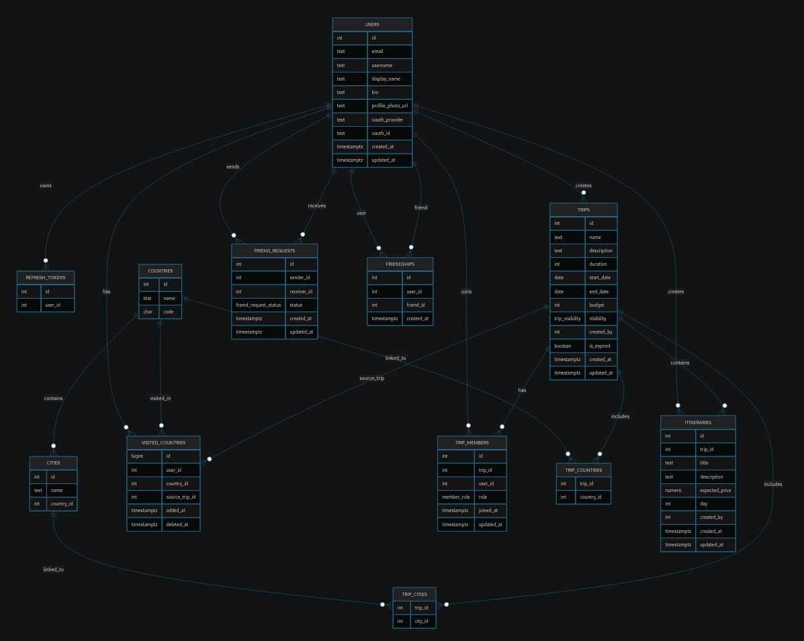

_This project has been created as part
of the 42 curriculum by ddias-fe, mjoao-fr, mmiguelo, peferrei._

# Description

Trippie is a travel planning and social platform built for the 42 Transcendence project. The application allows users to authenticate with Google, manage their profile, create and organize trips, add members, build itineraries, track visited countries, and connect with other users through a friendship system.

The project combines a modern Angular frontend with a .NET 9 backend, a PostgreSQL database, Redis caching, and MinIO for file storage. Its goal is to provide a structured, scalable, and maintainable web application while demonstrating team collaboration, software architecture decisions, and the integration of multiple backend services.

Main features include user authentication, trip management, itinerary planning, profile pages, friend management, visited-country tracking, file uploads, and a modular backend architecture.

# Instructions

## Prerequisites

- Docker and Docker Compose
- .NET 9 SDK
- Node.js and npm
- A PostgreSQL-compatible environment if running without Docker
- Google OAuth credentials
- MinIO credentials
- Environment variables configured for backend and frontend execution

## Environment setup

The project relies on environment variables for configuration. The backend expects values such as PostgreSQL host, port, database name, user and password, JWT secrets, Google OAuth settings, and MinIO access details. The frontend also expects the API URL during build or runtime, depending on the setup.

## Run with Docker

- Create and configure the required environment variables.
- Start the infrastructure and application containers using Docker Compose.
- Wait for PostgreSQL, Redis, MinIO, backend, frontend, and Nginx to become available.
- Access the application through the exposed frontend port or reverse proxy.

## Run locally

- Start PostgreSQL, Redis, and MinIO.
- Configure the backend environment variables.
- Run the backend with the .NET 9 SDK.
- Install frontend dependencies with npm.
- Start the Angular frontend in development mode.
- Ensure the frontend points to the correct backend API URL.

## Database migrations

The backend supports SQL-based database setup and migrations from the Migrations folder. They can be executed through the application startup flow or the migration path used by the backend bootstrap logic.

## Useful commands

in the base directory run `make` - to build the entire project.
in the base directory run `make fclean` - to clean the docker containers;
in the base directory run `make dev` - to build the docker images for the containers in development mode;
in backend/src run `dotnet run --migrate` - to seed the databases;
in backend/src run `dotnet run` - to run the backend;
open another terminal, in the frontend folder run `npm install` - to install frontend dependencies;
in the frontend folder run `npm start` - to start the frontend.

# Resources

## Technical references

- Angular documentation: https://angular.dev
- Angular Material documentation: https://material.angular.io
- .NET documentation: https://learn.microsoft.com/dotnet
- Entity Framework Core documentation: https://learn.microsoft.com/ef/core
- PostgreSQL documentation: https://www.postgresql.org/docs/
- Redis documentation: https://redis.io/docs/latest/
- MinIO documentation: https://min.io/docs/minio/linux/index.html
- Google OAuth documentation: https://developers.google.com/identity/protocols/oauth2
- SCRUM Guide: https://scrumguides.org

## AI usage

AI was used as a support tool for:

- research and learning while adopting new tools and libraries;
- understanding unfamiliar concepts and frameworks;
- debugging assistance;
- code review and best-practice guidance;
  AI was not used as a replacement for team decision-making, implementation ownership, or project planning. Final technical choices, architecture, and code decisions were made by the team.

# Team Information

## Pedro

**Product Owner and Backend Developer**  
Responsibilities: prioritizing work, defining product direction, implementing backend features, and supporting database and server-side development.

## Maria João

**Project Manager and Frontend Developer**  
Responsibilities: organizing the team workflow, managing delivery planning, implementing frontend features and API integration, and contributing to the UI, user experience, and web design.

## Marco

**Tech Lead and Backend Developer**  
Responsibilities: guiding the technical direction, supporting backend architecture, reviewing implementation choices, and contributing to core backend systems.

## Diogo

**Tech Lead and Frontend Developer**  
Responsibilities: supporting technical decisions, contributing to frontend architecture, implementing frontend features, and helping connect frontend behavior with backend APIs.

## Team Collaboration

Although each feature had an owner, development was collaborative. Team members regularly complemented each other’s work, shared implementation details, and helped with debugging and integration to keep the product consistent.

# Project Management

The team worked using the SCRUM methodology. We organized the project through GitHub Projects, which was used to distribute tasks, track progress, and keep the work visible to everyone. Communtication was held through Slack, Whatsapp and Discord.

Our workflow was based on:

- sprint planning sessions at the beginning of each sprint
- daily meetings to synchronize progress and unblock issues
- sprint reviews to validate completed work
- collaborative development, where each feature had a frontend and backend owner but the team regularly supported each other
  We worked in sprints of approximately 2 to 3 weeks. Communication was kept active throughout the project to make sure frontend, backend, and infrastructure work stayed aligned.

# Technical Stack

## Frontend

- Angular
- Angular Materials
- Angular CDK
- Transloco for internationalization
- RxJS for reactive programming
- Luxon for date handling

## Backend

- .NET 9
- ASP.NET Core Web API
- Entity Framework Core
- Npgsql for PostgreSQL integration
- JWT authentication
- Google OAuth
- Serilog for structured logging
- MinIO SDK for object storage
- EFCore.BulkExtensions for bulk operations

## Infrastructure

- PostgreSQL as the main relational database
- Redis for caching and fast transient data
- MinIO for file storage
- Docker and Docker Compose for local and containerized deployment
- Nginx as reverse proxy in the Docker setup

## Technical choices

- Angular was chosen to learn and apply a more structured frontend framework with a clear architecture.
- .NET 9 was chosen for a robust backend with strong support for modular APIs and maintainable code.
- PostgreSQL was chosen because the project has many relational entities and dependencies between users, trips, members, friendships, and itineraries.
- Redis was chosen to support fast temporary storage and demonstrate scalable service integration.
- MinIO was chosen as an S3-compatible storage solution for uploaded files without relying on external cloud services.
- Google OAuth was chosen to provide a secure and convenient authentication flow.
- The backend and frontend chose to follow an Onion-inspired layered architecture, separating the application into DTOs, Models, Services, Routers, and Configuration. Each feature was implemented as a complete CRUD workflow, with routers exposing the endpoints, services containing the business logic, models handling data persistence, DTOs defining the data exchanged between layers, and EF Core configuration managing the database mappings. This separation of concerns made the project easier to maintain, test, and extend, while allowing multiple team members to work on different features with fewer merge conflicts and clearer responsibilities. The main drawback was the increased amount of boilerplate and the additional time required to implement new features across multiple layers.
- All core features were implemented as complete CRUD (Create, Read, Update, Delete) workflows across both the frontend and backend. Users can consistently create, view, update, and delete application data through an intuitive interface.

# Database Schema

The database is structured around users, trips, and social relationships.

## Main entities

- Users: account and profile data
- Auth and refresh tokens: authentication state and session management
- Countries and cities: geographic reference data
- Visited countries: stores which countries a user has visited
- Trips: travel plans created by users
- Trip members: users associated with a trip
- Trip countries and trip cities: destinations linked to a trip
- Itineraries: trip schedules and activities
- Friend requests: pending friendship invitations
- Friendships: confirmed relationships between users

## Relationships

- A user can create multiple trips
- A trip can have multiple members
- A trip can include one countries and multiple cities
- A user can have multiple visited countries
- Users can send and receive friend requests
- Confirmed friendships connect two users
- Trips can have one or more entries in itineraries

_Notes_
The backend maps PostgreSQL enums for trip visibility, trip member role, and friend request status to keep the schema expressive and type-safe.

# Features List

- Google OAuth login and authentication
- User registration and account management
- Profile pages
- Trip creation and editing
- Trip dashboard
- Trip member management
- Friendship and friend request system
- My Trips page
- Itinerary planning
- Visited countries tracking with a background service that updates them
- File upload support through MinIO
- Redis cache
- Internationalized frontend
- Route protection and permissions
- Health checks and structured logging
- Rate limiting and global exception handling

## Feature ownership

Pedro: Backend - Registration, Login, Profile, Trip creation and editing, MinIO, Route protection and permissions, Exception handling and rate limiting.
Maria João: Frontend - Google OAuth, Account management, Profile, Trip creation and editing, Trip dashboard, Visited countries, File upload, Internationalized frontend, route protection and permissions.
Marco: Backend - Google OAuth, Trip member management, Friendship and friend request system, Itinerary planning, Visited countries tracking with a background service that updates them, Redis cache, Route protections and permissions, Rate limiting and global exception handling.
Diogo: Frontend: - Registration and login, Trip members, Member friendships, My Trips page, Itinerary planning, Internationalized Frontend, Route protection and permissions, Health checks and structures logging.

# Modules

## Frameworks (2)

The project uses Angular and .NET to demonstrate work with modern web frameworks.  
. The entire team worked on this module. Initially is was supposed to be Java and Spring Boot for BE, but the team was having issues adapting to such a different language from C++, so we changed our stack to C#.

## User Management (2)

Our application supports user management, such as updating profile information (display name and description/biography), upload/update account avatar, we have a friendship feature and we allow the user to manage his friends and the users can view their profile and others profile with specific information and statistics about them.
The entire team worked on this module:  
. Pedro and Maria: worked on updating and uploading profile information, and other information that is displayed in the user's profile;  
. Diogo and Marco: worked on the friendship management.  
The major challenge here was the logic behind the friendships implementation and it was overcome by speaking with the other team members to reach a solution.

## Permissions (2)

Our app has a permissions system to manage the trips. If you are 'admin', you have all the power to make changes and manage the trip's members and you can also manage all itinerary entries. If you are just a 'member', you can't manage the trip crew, but you can still add entries to the itinerary while being able to delete only your own entries.  
. Maria, Marco and Diogo worked on this module for different elements and features related to the Trip Dashboard. It was tricky at first, but once we got the hang of it, it went smoothly.

## Organizations (2)

Trippie has organizations: the TRIPS. You can create, edit or delete it; you can add and remove members from it (based on the previous module). The users can view the organization (through the Trip Dashboard) and add entries to the itinerary (create), read the entries from the itinerary and other trip's information (read) and update/delete based on the permission to do so.  
. The entire team worked on this since it is the core of our application.

## ORM (1)

Entity Framework Core was chosen to handle relational persistence through a clean ORM (Object.Relational Mapper) layer, making it easier to map the application’s entities to PostgreSQL and manage their relationships in a structured and maintainable way.  
. Marco was responsible for developing this. He has a few difficulties because it was his first time working with something like this, but he studied how to approach this.

## Custom Design System (1)

The frontend was built with a coherent visual identity defined in [FIGMA](https://www.figma.com/design/3i1hxQ2mzZakjluDTGKfRr/Trippie?node-id=0-1&p=f&t=IHJN4N8GkyU99Jwz-0) instead of relying on default styling.  
. Maria was responsible for developing the entire visual identity with the approval of the team.

## Advanced Search (1)

We implemented advanced search to let users filter, sort, and paginate results across the application. This makes it easier to discover trips, people, and related content efficiently, especially as the amount of data grows.  
. Marco was the one responsible for developing this.

## Language (1)

We implemented an i18n system that supports three languages: EN, PT and ES. There's a language switcher available through the entire application. All the text is translatable, but the logo and the slogans.  
. Maria and Diogo were responsible for making this work.

## Support for additional browsers (1)

Our application works consistently through multiple browsers (Chrome, Firefox and Opera).
We noticed just one specification we had to be careful with:

- Favicon (we noticed that our approach was working on Chrome, but not on Firefox, so we just switched our approach to work on both).

. Maria and Diogo were responsible for this module.

## OAuth (1)

You can enter our app with Google. We think this is a very useful feature and adds more value to our app.  
. Maria and Marco developed this module. It was challenging, but through research we overcame the difficulties.

## User Activity Analysis (1)

Our app keeps track of some user stats both in the user dashboard and user profile (Visited Countries, Trips Booked This Year and How Many Days Left Until Next Trip). We also have a budget bar in the Trip Dashboard that keeps track of the expected budget through itinerary entries and updates as soon as you add something to the itinerary.  
. Maria, Marco and Pedro: developed the Profile and User Dashboard stats;  
. Maria and Marco developed the budget bar/logic to reach the expected budget.

## Redis (1)

Redis adds performance-oriented infrastructure and shows the use of a supporting cache service to prevent unnecessary calls to the database for information that is popular and doesn't change, increasing the performance of the website.  
. Marco developed this. It was challenging, but he watched some tutorials and he overcame the difficulties.

## MinIo (1)

MinIO adds real object storage support and demonstrates integration with an external storage service. It was used for our avatar pictures.  
. Pedro developed this.

## Logs System (1)

The logging system was implemented to provide centralized error tracking, better observability, and easier debugging during development. It helps the team monitor backend behavior and identify failures faster.  
. Diogo implemented this.

## Limitations and Notes

Some features depend on configured external services such as Google OAuth and MinIO.
The project assumes the required environment variables are available before startup.
The final behavior depends on the correct setup of the backend, frontend, and supporting infrastructure.
